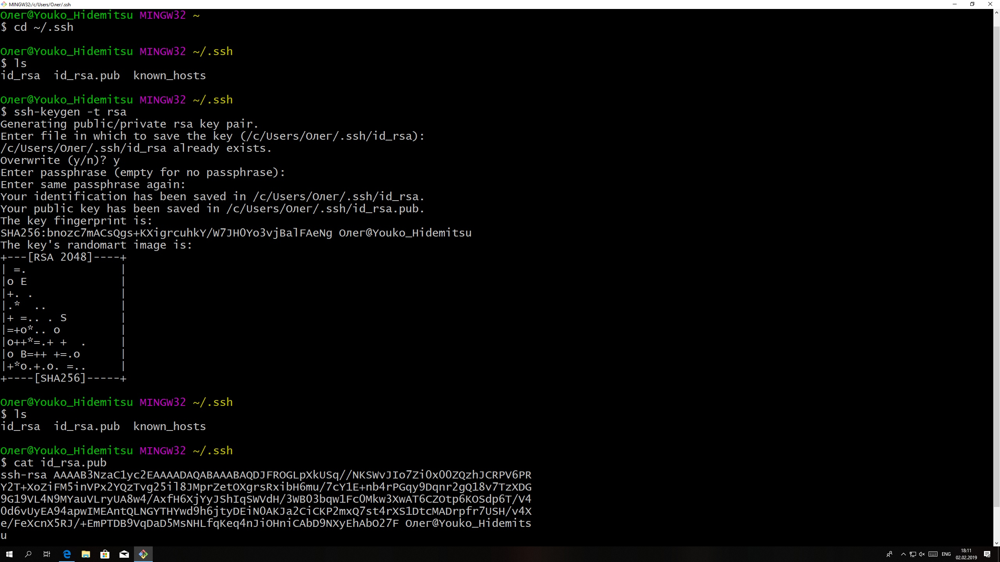

# Установка и настройка GIT'а

### Установка
1. Переходим на [оф., сайта]( https://git-scm.com/download/win ) GIT'а и скачиваем. ( Важно, чтобы при установке был поставлен флажок над GIT bush ).
2. Регестрируемся на [GitHub]( https://github.com/ ).
### Настройка
1. Для работы с удаленным репозиторием на GitHub нам потребуется ssh ключ. Найти его можно в директории C:\Users\(Имя пользователя)\.ssh на вашем устройстве. Ключей может быть несколько, подойдёт любой. (открывать с помощью любого текстового редактора). Но мы сделаем это через консоль гита, так что запускаем Git Bush.exe.
2. Вводим: 
	* `cd ~/.ssh`
	* `ls`
3. Нам выводится список всех наших ключей, если их нет то вводим
	* `ssh-keygen` или `ssh-keygen -t rsa -b 4096 -C "youko.hidemitsu@gmail.com"` и будет видно, что именно вы внесли изменение. Просто жмем enter 
4. Получаем содержимое ключа
	* `cat id_rsa.pub`
 	( если у вас другое название ключа берите его с форматом .pub )
5. Переходим по [ссылке]( https://github.com/settings/keys) и создаем новый shh ключ, копируя туда то, что мы получили в пункте 4.
### Пример
 
