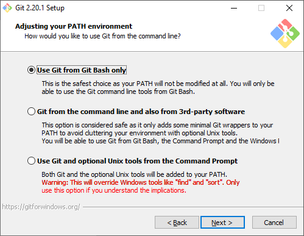
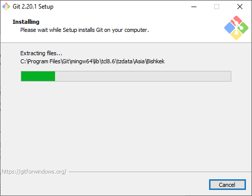

# Установка и настройка Git
Версия мануала не является конечной!

## Начало работы
***
## Установка и настройка в Windows
### Установка
1. Переходим по [ссылке загрузки](https://git-scm.com/download/win) с официального сайта Git и скачиваем установочный файл.
2. Запускаем Git-VERSION-BIT.exe и читаем лицензионное соглашение, после жмем "Next".

3. Выбираем директорию для установки Git и жмем "Next".

4. Выбираем необходимые к установке компоненты. Важно убедиться в наличии галочки на пукте Windows Explorer integration, это понадобится для более удобной работы с Git в Проводнике Windows.

5. Решаем, нужна ли нам папка в меню Пуск.

6. Выбераем текстовый редактор по умолчанию. Он понадобиться нам для написания развернутых комментариев к коммитам и пр. Мы рекомендуем использовать Vim или Nano - консольные решения, довольно простые и быстрые, изучив которые возможно экономить время на комментировании.

7. Выбираем, где будет возможно использовать Git. Далее будет описываться работа с эмулятором Bash-терминала.

8. OpenSSL (особенности выбора, возможно, будут дополнены позже).

9. Выбираем первый пункт, как рекомендованный для Windows.

10. Настраиваем эмулятор терминала под себя.

11. Выбираем нужные для себя пункты и нажимаем "Install" для начала установки Git в Windows.

12. Дожидаемся завершения процесса установки.

13. Запускаем Git Bash для начала работы с Git.

### Настройка Git, подключение Git к репозиторию GitHub. 
#### Создание GitHub репозитория.
1. [Регестрируемся](https://github.com/join) на GitHub, если прежде это не было сделано.

2. [Создаем репозиторий](https://github.com/new).

3. В новозарегестрированном репозитории находим пункт Quick setup. Ссылка из него понадобиться для последующего подключения посредством Git.

#### Подключение к удаленному репозиторию.
1. Для работы с удаленным репозиторием на GitHub нам потребуется SSH ключ. Если он прежде был создан, то по-умолчанию найти его можно в директории C:\Users\USERNAME\\.ssh на Вашем Windows-устройстве. Ключей может быть несколько, подойдёт любой. Если он не был прежде создан, то воспользуется Git Bash.

2. Для создания нового SSH ключа: 
	1. Вводим`ssh-keygen -t rsa -b 4096 -C "Ваша электронная почта, например, hello@gmail.com"` для генеграции нового SSH ключа.
	2. Далее на запрос `Enter file in which to save the key (/c/Users/USERNAME/.ssh/id_rsa):`, либо укажем путь для хранения SSH ключей, либо просто нажмем Enter, чтобы хранить в директории по-умолчанию.
	3. В ответ на запрос `Enter passphrase (empty for no passphrase):` по желанию можно указать ключевое слово для защиты ключа.
	4. Далее переходим в папку .ssh командой `cd .ssh` и вводим `ls` для вывода содержимого текущей директории.
	5. Файл **"что-то.pub"** - то, что нам нужно. Для вывода его содержимого в консоль укажем `cat id_rsa.pub` (id_rsa - имя по-умолчанию).
	6. Копируем ключ и идем на [страницу добавления нового SSH ключа](https://github.com/settings/ssh/new) на GitHub, где в поле Title вводим придуманное название ключа, а в поле Key - сам ключ. Сохраняем.
	
3. Теперь подключим удаленный репозиторий GitHub.
	1. Вернемся в домашнюю директорию путем ввода `cd ~`. Создадим отдельную папку для него `mkdir ИмяНовойПапки`. После переходим в нее `cd ИмяНовойПапки`.
	2. `git init` для инициализации репозитория в данной директории.
	3. `git remote add origin https://github.com/blacklyredlyshy/test.git` для подключения нашего нового удаленного репозитория с присовоением ему локального имени "origin" (имя может быть произвольным).

## Использование Git
## Видео теме (Позже будет добавлен текстовый мануал)
[Ссылка на плейлист от **loftblog**](https://www.youtube.com/playlist?list=PLY4rE9dstrJyTdVJpv7FibSaXB4BHPInb)

#### Версия мануала не является конечной!
